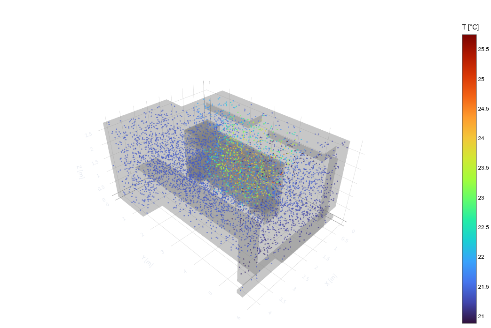
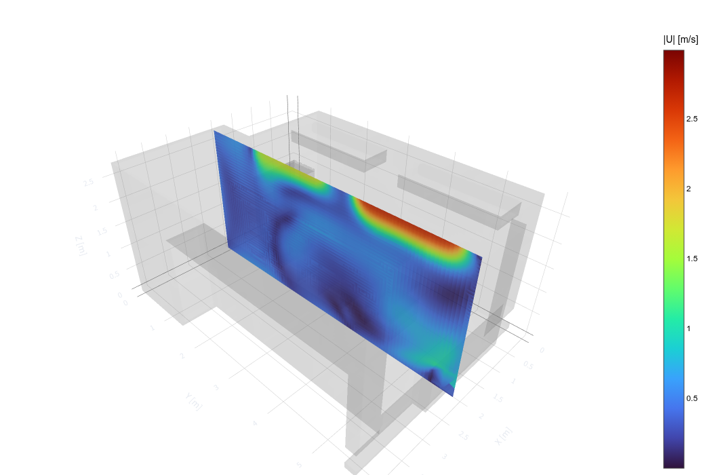
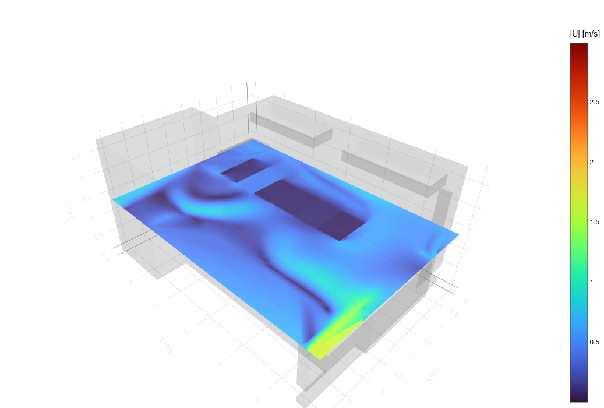

# DC-T²: Thermal Twin for Data Centres
DC-T² (Data Centre Thermal Twin) is an open-source, web-based platform that transforms CFD-based thermal modeling into an accessible and collaborative digital twin for data centres. 
DC-T² enables rapid exploration of thermal scenarios, identification of inefficiencies and evaluation of operational strategies, empowering data-centre stakeholders with actionable, decision-ready thermal insight across the entire facility lifecycle.
Unlike classical CFD workflows that remain confined to local machines and static reports, DC-T² allows the thermal suitability and performance of a data centre to be shared seamlessly with operators, designers and decision-makers. Thermal insights can be communicated interactively—without the need for intensive software installations, dense simulation setups, or lengthy reporting—making thermal intelligence accessible even within fast-paced operational environments.
## Features
- **3D Point Cloud Visualization**: Three-dimensional temperature and airflow distribution of the data centre
- **2D Slice Analysis**: Sliceable views along X, Y, Z axes
- **Interactive Controls**: Slice thickness, grid resolution, and point count adjustments
- **KPI Monitoring**: Data centre performance indicators (RCI, RTI, RHI, RI, CCI)
## Usage
### Visualization Options
1. **Field Selection**: Temperature (°C) or Airflow Velocity (m/s)
2. **View Mode**: 
   
   - **3D Scatter**: View of all data points
   
     
   
   - **2D Slice**: Cross-section view on a specific axis
   
     

       
       
     

### 2D Slice Settings
- **Slice Axis**: Select slice plane (X/Y/Z)
- **Slice Thickness**: Thickness of the slice (1-5%)
- **Grid Resolution**: Interpolation resolution (500-2000)
## Data Structure
The NPZ file must contain the following data:
- `points`: Mesh point coordinates
- `cells`: Cell connectivity information
- `cell_types`: PyVista cell types
- `T`: Temperature field (Kelvin)
- `U`: Velocity vector field (m/s)
## Typical Use Cases
- KPI-based thermal performance assessment of existing data-centre facilities
- Identification of thermal bottlenecks and inefficiencies through KPI trends
- Visualization of airflow and temperature distributions within the data centre
  
---
## License
Copyright © 2026 Design and Simulation Technologies Inc.
DC-T2 Community Edition is licensed under the **GNU Affero General Public License v3.0 (AGPLv3)**.
Commercial use, including integrating DC-T2 into a closed-source product, offering it as a managed service, or deploying it in an enterprise environment without AGPL obligations, requires a separate commercial license.
For such use cases, please contact **Design and Simulation Technologies Inc.** at **datacenter@dstechs.net** regarding our Enterprise License options.
